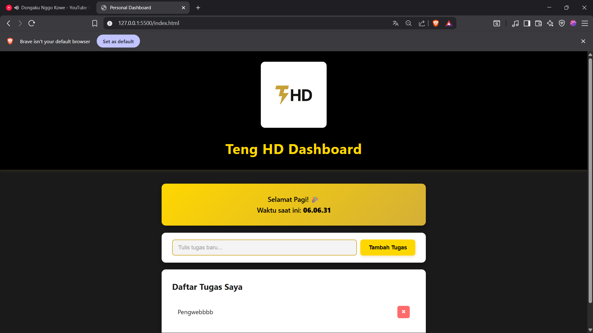

# Teng HD Dashboard - Praktikum JavaScript Next Gen

Ini adalah aplikasi *personal dashboard*  JavaScript Next Gen (ES6+).

## 📸 Tampilan Aplikasi

## 📝 Penjelasan Singkat

Aplikasi ini berfungsi sebagai *dashboard* pribadi untuk mengelola daftar tugas (To-Do List). Aplikasi ini dirancang dengan tema premium (hitam, emas, dan putih) dan menampilkan logo THD kustom. Semua data tugas disimpan di `localStorage` browser, sehingga data tidak akan hilang meskipun halaman di-*refresh*.

## ✨ Fitur Utama

* **Tambah Tugas:** Menambahkan item tugas baru ke dalam daftar.
* **Hapus Tugas:** Menghapus tugas yang sudah selesai atau tidak relevan.
* **Penyimpanan Lokal:** Semua tugas disimpan di `localStorage` browser.
* **Waktu Asinkron:** Menampilkan waktu saat ini yang diambil secara asinkron dari API eksternal (WorldTimeAPI).

## 🚀 Fitur ES6+ yang Diimplementasikan

Sesuai dengan kriteria tugas, aplikasi ini dibangun menggunakan fitur-fitur JavaScript modern (ES6+):

* **`let` dan `const`**: Digunakan di `app.js` untuk deklarasi variabel. `const` digunakan untuk seleksi DOM dan variabel yang nilainya tetap, sementara `let` digunakan untuk array tugas yang datanya dinamis.
* **Arrow Functions (`=>`)**: Digunakan untuk semua *event listener* (submit form, klik hapus) dan fungsi *helper* (seperti `getTasksFromStorage`), membuat kode lebih ringkas dan mudah dibaca.
* **Template Literals** (Backticks `` ` ``): Digunakan di dalam fungsi `renderTasks` untuk membuat dan merender elemen HTML daftar tugas ke DOM secara dinamis.
* **Classes**: Menggunakan `class Task` di `app.js` sebagai *blueprint* (cetakan) untuk membuat setiap objek tugas, lengkap dengan properti `id` dan `text`.
* **Async/Await**: Digunakan pada fungsi `fetchTime` untuk mengambil data waktu dari API publik (WorldTimeAPI) secara asinkron, lengkap dengan *error handling* (`try...catch`).

## 🛠️ Cara Menjalankan

1.  Clone repositori ini.
2.  Masuk ke folder praktikum yang sesuai.
3.  Buka file `index.html` di browser (disarankan menggunakan ekstensi **Live Server** di VS Code untuk fungsionalitas penuh).