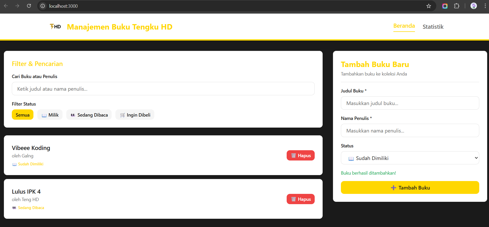

# 📚 Manajemen Buku Pribadi - Aplikasi React

Nama: Tengku Hafid Diraputra
NIM : 123140043
Aplikasi React untuk mengelola koleksi buku pribadi. Dibuat dengan desain premium (tema Emas/Hitam/Putih) dan dilengkapi fitur filter, pencarian real-time, dan dashboard statistik.

---

## 🚀 Instruksi Instalasi dan Menjalankan

1.  Buka terminal di folder project Anda.
2.  Install semua *dependencies* yang dibutuhkan:
    ```bash
    npm install
    ```
3.  Jalankan *development server*:
    ```bash
    npm run dev
    ```
4.  Buka [http://localhost:3000](http://localhost:3000) di browser Anda untuk melihat aplikasi.

---

## 🖼️ Screenshot Antarmuka

Berikut adalah tampilan utama dari aplikasi:



---

## 🛠️ Fitur React yang Digunakan

Aplikasi ini dibangun menggunakan beberapa fitur inti React dan ekosistemnya:

* **Komponen Fungsional:** Seluruh UI dibangun menggunakan komponen fungsional (misal: `BookForm.tsx`, `BookList.tsx`).
* **State Management (Context API):** Menggunakan `BookContext` untuk mengelola dan membagikan *state* (data buku) secara global ke seluruh komponen.
* **Custom Hooks:** Memanfaatkan *custom hook* (`useLocalStorage`) untuk menyimpan data buku secara persisten di *local storage* browser.
* **Routing (Next.js):** Menggunakan sistem routing bawaan Next.js untuk navigasi antar halaman (Beranda & Statistik).
* **TypeScript:** Digunakan di seluruh proyek untuk memastikan *type safety* dan mengurangi bug saat pengembangan.

---

## 💬 Komentar dalam Kode

Komentar penjelasan telah ditambahkan pada bagian-bagian kode yang dianggap penting (seperti pada *custom hooks* dan *logic* di dalam Context API) untuk mempermudah pemahaman alur data dan fungsionalitas.

---

## 🧪 Laporan Testing

Aplikasi ini dilengkapi dengan *unit tests* menggunakan **Jest** dan **React Testing Library** untuk memastikan fungsionalitas berjalan sesuai harapan.

Untuk menjalankan tes, gunakan perintah:
```bash
npm run test