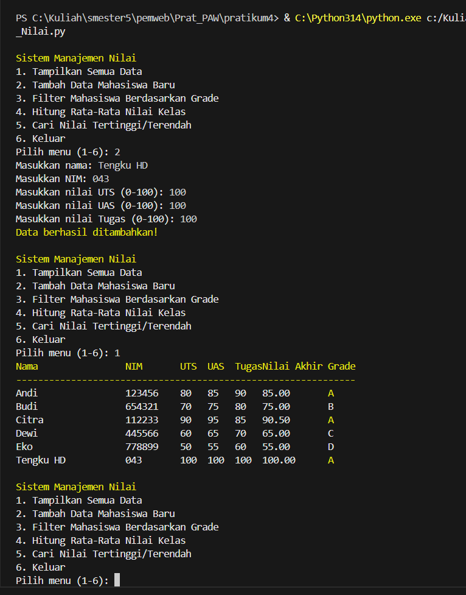

# Sistem Manajemen Nilai Mahasiswa

Nama==Tengku Hafid 
NIM===123140043

Halo! Ini adalah program sederhana berbasis Python untuk mengelola data nilai mahasiswa. Dibuat untuk latihan, tapi cukup fungsional buat keperluan dasar seperti menambah data, hitung nilai akhir, dan filter grade.

---

## 🚀 Cara Instalasi

1.  Pastikan Python 3 sudah terinstal di komputer Anda.
2.  Simpan file `manajemen_nilai.py` di folder Anda.
3.  Jalankan program melalui terminal dengan perintah:
    ```bash
    python manajemen_nilai.py
    ```
    *(Gunakan `python3` jika perintah `python` tidak terhubung ke Python 3 di macOS/Linux)*

---

## ✨ Fitur Utama

* **Tampilkan Data:** Menampilkan semua data mahasiswa dalam tabel rapi (dengan warna emas dan putih).
* **Tambah Data:** Menambahkan data mahasiswa baru.
* **Filter Grade:** Menyaring mahasiswa berdasarkan grade (A, B, C, D, E).
* **Rata-rata Kelas:** Menghitung rata-rata nilai akhir dari semua mahasiswa.
* **Nilai Ekstrem:** Menampilkan mahasiswa dengan nilai tertinggi dan terendah.
* **Keluar:** Menghentikan program.

---

## 📸 Contoh Hasil Jalannya

Berikut tampilan saat program dijalankan:

