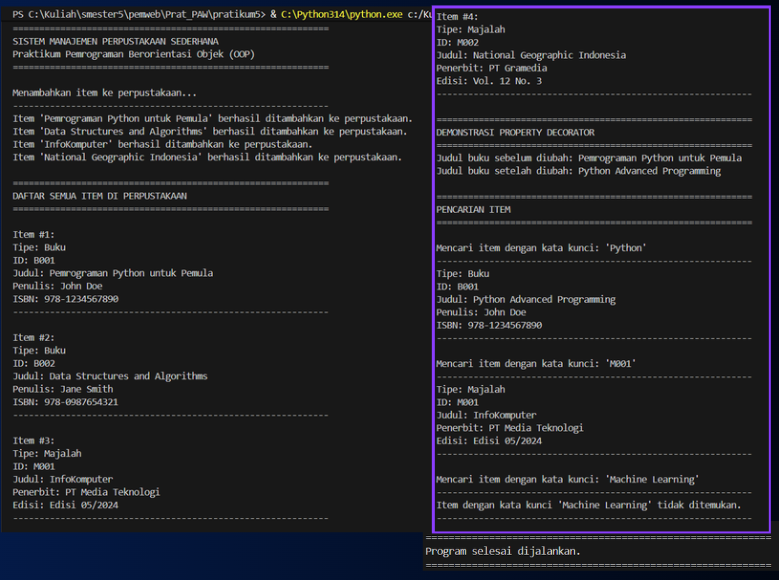

# Sistem Manajemen Perpustakaan Sederhana (Praktikum OOP Python)

**Tugas:** [Tengku hafid Diraputra] - [123140043] 

Ini adalah proyek tugas praktikum untuk mata kuliah Pemrograman Berorientasi Objek, yang diimplementasikan menggunakan Python.

## 1. Penjelasan Program

Program ini adalah simulasi sistem manajemen perpustakaan sederhana. Program ini menerapkan konsep-konsep inti OOP seperti:

* **Abstract Class** (`LibraryItem`) - Menggunakan modul `abc` untuk mendefinisikan kelas abstrak yang menjadi blueprint untuk semua item perpustakaan.
* **Inheritance** (`Book` dan `Magazine` mewarisi dari `LibraryItem`) - Kedua kelas ini mewarisi atribut dan metode dari kelas parent.
* **Encapsulation** (menggunakan atribut protected `_` dan private `__`) - Melindungi data dengan menggunakan konvensi penamaan Python untuk akses terbatas.
* **Polymorphism** (metode `list_all_items` memanggil `display_details` dari objek yang berbeda) - Satu metode yang sama dapat dipanggil pada objek yang berbeda dan menghasilkan output yang sesuai dengan tipe objeknya.

## 2. Fitur-fitur Program

* Menambahkan item baru (Buku atau Majalah) ke dalam koleksi perpustakaan.
* Menampilkan daftar lengkap semua item beserta detail spesifiknya.
* Mencari item dalam koleksi berdasarkan ID atau Judul (case-insensitive).
* Menggunakan *Property Decorator* untuk mengelola akses ke atribut (pada judul Buku).

## 3. Struktur Kelas

### LibraryItem (Abstract Base Class)
- Atribut: `_item_id`, `_title`
- Metode abstrak: `display_details()`

### Book (Turunan dari LibraryItem)
- Atribut tambahan: `_author`, `_isbn`
- Property decorator: `@property` dan `@setter` untuk `title`
- Implementasi: `display_details()`

### Magazine (Turunan dari LibraryItem)
- Atribut tambahan: `_publisher`, `_issue_number`
- Implementasi: `display_details()`

### Library
- Atribut private: `__collection`
- Metode: `add_item()`, `list_all_items()`, `search_item()`

## 4. Cara Menjalankan Program

1. Pastikan Python 3.x sudah terinstal di sistem Anda
2. Buka terminal/command prompt
3. Navigate ke folder yang berisi file `library_system.py`
4. Jalankan perintah:
   ```bash
   python library_system.py
   ```

## 5. Hasil Running Program (Screenshot)

Berikut adalah screenshot terminal yang menunjukkan output dari program setelah dijalankan:



## 6. Penerapan Konsep OOP

| Konsep OOP | Implementasi dalam Program |
|------------|----------------------------|
| **Abstraction** | Class `LibraryItem` sebagai ABC dengan metode abstrak `display_details()` |
| **Inheritance** | Class `Book` dan `Magazine` mewarisi dari `LibraryItem` |
| **Encapsulation** | Atribut protected (`_`) pada `LibraryItem`, `Book`, `Magazine`; atribut private (`__collection`) pada `Library` |
| **Polymorphism** | Metode `display_details()` dipanggil pada objek berbeda (Book/Magazine) dalam loop `list_all_items()` |
| **Property Decorator** | Getter dan setter untuk atribut `title` pada class `Book` |

## 7. Contoh Output Program

Program akan menampilkan:
1. Proses penambahan item ke perpustakaan
2. Daftar lengkap semua item dengan detailnya
3. Demonstrasi penggunaan property decorator
4. Hasil pencarian item (berhasil dan gagal) 

---

 
